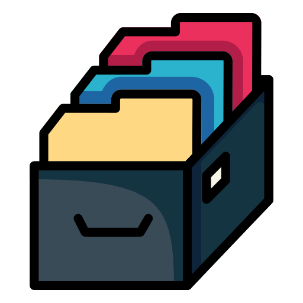

<div id="top"></div>


<br />
<div align="center">
    

  <h3 align="center">Edit JSON with Node.js</h3>

  <p align="center">
    A beginner project to practice and try with JSON files and node.js !
    <br />
    <a href="https://github.com/wicket-warrick/exampleNodeBookList"><strong>Explore the docs »</strong></a>
    <br />
    <br />
  </p>
</div>

<details>
  <summary>Table of Contents</summary>
  <ol>
    <li>
      <a href="#about-the-project">About The Project</a>
      <ul>
        <li><a href="#built-with">Built With</a></li>
      </ul>
    </li>
    <li>
      <a href="#getting-started">Getting Started</a>
      <ul>
        <li><a href="#prerequisites">Prerequisites</a></li>
        <li><a href="#installation">Installation</a></li>
      </ul>
    </li>
    <li><a href="#usage">Usage</a></li>
    <li><a href="#roadmap">Roadmap</a></li>
    <li><a href="#license">License</a></li>
    <li><a href="#contact">Contact</a></li>
  </ol>
</details>
<br/>

# About The Project

Learning project about edit JSON files ; and create a basic server with node.js and express.js

We are going to work with a json file with books (as a database).
With the different requests; you will be able to get the books, search by isbn, edit and delete data.

<p align="right">(<a href="#top">back to top</a>)</p>

### Built With

- [Node.js](https://nodejs.org/)
- [Express.js](https://expressjs.com/)
- [npm](https://npmjs.com/)
<p align="right">(<a href="#top">back to top</a>)</p>

# Getting Started

In the next chapter you can read how to download and install this project


## Installation

To get started, you must have a local copy on your computer.
There are two options:

A. CLONE the repo.

```sh
git clone git@github.com:wicket-warrick/exampleNodeBookList.git
```

B. DOWNLOAD the repo.
</br>
</br>
<a href='https://github.com/wicket-warrick/exampleNodeBookList/archive/refs/heads/main.zip'> Download repository</a>

## Config

1. Install NPM packages

   ```sh
   npm install
   ```

2. <p>Rename the '.example.env' file to '.env'; and configure the variables to be able to execute the project.</p>

3. <p>Import the <a href=https://github.com/wicket-warrick/exampleNodeBookList/blob/main/API%20books.postman_collection.json>POSTMAN collection</a>, in order to test the API functionalities.</p>

<p align="right">(<a href="#top">back to top</a>)</p>

## Usage

- **GET /books/** Get all books in the JSON file.
- **GET /books/:isbn** Get data book ,search by isbn.
- **POST /books/** Create new book .
- **PUT /books/:isbn/** Change data book ,search by isbn.
- **DELETE /books/:isbn** Delete data.

## Roadmap

- [ ] Search by other issues(name,author...)
- [ ] DB with SQL.
- [ ] others()

<p align="right">(<a href="#top">back to top</a>)</p>

## License

Distributed under the MIT License. See `LICENSE.txt` for more information.

<p align="right">(<a href="#top">back to top</a>)</p>

# Contact


[![Linkedin][linkedin-shield]](https://www.linkedin.com/in/hugosuarezdevp)

[![GitHub][github-shield]](https://github.com/wicket-warrick)

<p align="right">(<a href="#top">back to top</a>)</p>

[linkedin-shield]: https://img.shields.io/badge/LinkedIn-0077B5?style=for-the-badge&logo=linkedin&logoColor=white
[linkedin-url]: https://linkedin.com/in/othneildrew
[github-shield]: https://img.shields.io/badge/GitHub-100000?style=for-the-badge&logo=github&logoColor=white
